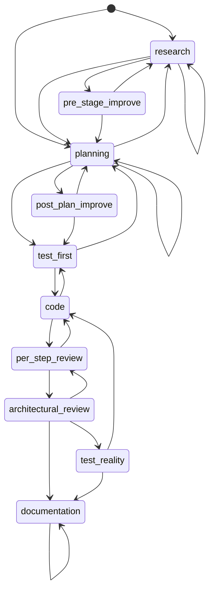
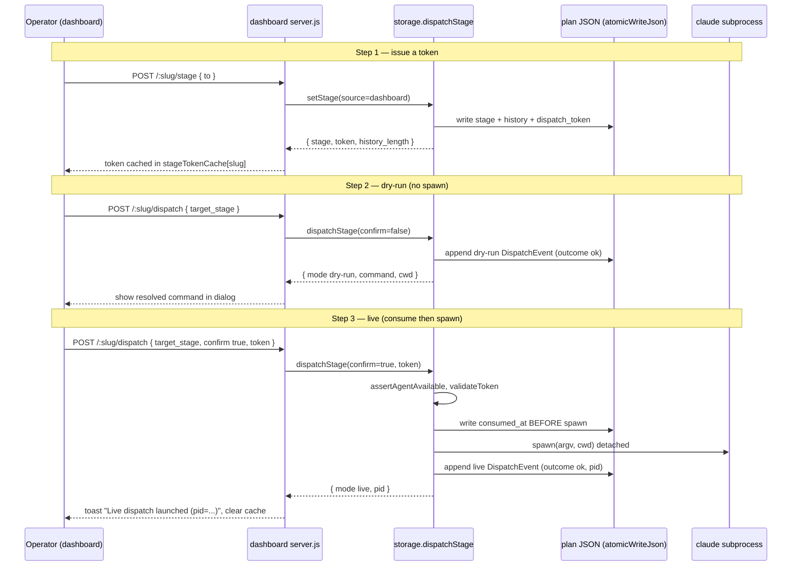

# claude-plans v2 — As-Built Implementation Reference

> **Scope.** This document describes the v2 bidirectional pipeline **as it was actually merged** (PRs #100–#104), grounded entirely in the source under `packages/claude-plans/src/` and `packages/dashboard/`. Its companion, [`v2-design.md`](./v2-design.md), is the _pre-implementation_ design. Where the build diverged from the design, this doc flags it honestly — see [§9 Deviations](#9-deviations-from-the-design-doc).
>
> Code conventions in this package: `var` everywhere (no `const`/`let` at runtime), no optional chaining, factory-injected side effects for testability.

## Table of Contents

1. [Overview](#1-overview)
2. [Storage schema](#2-storage-schema)
3. [The pipeline state machine](#3-the-pipeline-state-machine)
4. [The three new MCP tools](#4-the-three-new-mcp-tools)
5. [dispatch_stage safety model](#5-dispatch_stage-safety-model)
6. [Error taxonomy → HTTP status mapping](#6-error-taxonomy--http-status-mapping)
7. [Dashboard surfaces (Phase E)](#7-dashboard-surfaces-phase-e)
8. [Testing & backward-compat](#8-testing--backward-compat)
9. [Deviations from the design doc](#9-deviations-from-the-design-doc)
10. [Appendix: environment knobs](#10-appendix-environment-knobs)

---

## 1. Overview

### 1.1 What v2 adds over v1

v1 was a **one-directional** publish surface: Claude Code pushed plans, artifacts, prompts, questions, and lint events into a JSON store under `~/.dovetail/claude-plans/`, and the dashboard rendered them read-only (plus answer/delete). v2 makes the pipeline **bidirectional** by adding three capabilities:

| Capability               | Surface                          | What it enables                                                                                                                                    |
| ------------------------ | -------------------------------- | -------------------------------------------------------------------------------------------------------------------------------------------------- |
| **Stage state machine**  | `set_stage` + `state-machine.ts` | A plan can be moved through 10 pipeline stages with a legal-transition table and a dashboard-wins conflict rule.                                   |
| **Single-read snapshot** | `pull_plan` + `loadPlanFull`     | One call returns plan + artifacts + prompts + questions + stage state + dispatch log — for a resuming session or the dashboard detail page.        |
| **Stage dispatch**       | `dispatch_stage` + `dispatch.ts` | The dashboard (or a session) can spawn a new Claude Code subprocess to drive a plan at a stage, gated by a dry-run default and a single-use token. |

The MCP tool count goes from 14 to **17** (`src/registry.ts:49`, `TOOL_NAMES`): the existing 14 are preserved byte-for-byte, and `set_stage`, `pull_plan`, `dispatch_stage` are appended.

### 1.2 The five-phase delivery

| Phase | PR   | Delivered                                                                                                                                                             |
| ----- | ---- | --------------------------------------------------------------------------------------------------------------------------------------------------------------------- |
| **A** | #100 | Design doc (`docs/v2-design.md`) + v1-contract fixtures under `src/tests/fixtures/v1/`.                                                                               |
| **B** | #101 | `schema_version` field on `ClaudePlan`, `CURRENT_SCHEMA_VERSION=2`, `migrateV1OnLoad()`, schema stamped on every write.                                               |
| **C** | #102 | `state-machine.ts` (legal transitions + conflict rule), `setStage`/`set_stage`, `loadPlanFull`/`pull_plan`, token issuance.                                           |
| **D** | #103 | `dispatch.ts` (error taxonomy, command resolution, token validation, production spawn) + `dispatchStage`/`dispatch_stage`.                                            |
| **E** | #104 | Dashboard HTTP routes (`/stage`, `/dispatch`, `/answers`) + `sendTypedError`, and client surfaces (Stage Map, Questions tab, Dispatch dialog with `stageTokenCache`). |

### 1.3 Backward-compatibility guarantee

Two mechanisms guarantee a v1 store keeps working after the v2 upgrade:

1. **`migrateV1OnLoad()`** (`src/storage.ts:106`) — every read normalizes a v1 record (no `schema_version`, or `schema_version: 1`) into a v2-shaped object in memory. It only adds `schema_version: 2`; the v2 stage/dispatch fields stay `undefined` until a `setStage`/`dispatchStage` call introduces them. The on-disk upgrade is **lazy** — it materializes on the next write that touches the record.
2. **The v1-contract test** (`src/tests/v1-contract.test.ts`) — drives every preserved v1 tool through the registry against frozen-clock fixtures and asserts the response shape is unchanged. See [§8](#8-testing--backward-compat).

---

## 2. Storage schema

### 2.1 Additive v2 fields on `ClaudePlan`

All v2 fields are **optional and additive** (`src/types.ts:33`). A v1 record is a valid v2 record with these fields absent:

```ts
schema_version?: ClaudePlanSchemaVersion;   // 1 | 2; absent/1 on legacy records
stage?: PipelineStage | null;               // null until first staged
stage_history?: StageTransition[];           // append-only; empty if never staged
dispatch_token?: DispatchToken | null;       // current outstanding token; rotated on each set_stage
dispatch_log?: DispatchEvent[];              // append-only; dry-run AND live entries
```

Supporting shapes (`src/types.ts:98`–`132`):

```ts
interface StageTransition {
  from: PipelineStage | null;
  to: PipelineStage;
  at: string; // ISO 8601
  by: string; // session id or "unknown"
  source: "code" | "dashboard"; // drives conflict resolution
}

interface DispatchToken {
  token: string; // tok_<24-hex>  (12 bytes of crypto.randomBytes)
  issued_for_stage: PipelineStage;
  issued_at: string;
  expires_at: string;
  consumed_at?: string; // set when dispatch_stage consumes it
}

interface DispatchEvent {
  at: string;
  target_stage: PipelineStage;
  mode: "dry-run" | "live";
  by: string;
  command?: string;
  cwd?: string;
  outcome: "ok" | "missing-agent" | "stale-token" | "no-token" | "spawn-error";
  pid?: number;
  error?: string;
}
```

### 2.2 The v1→v2 migration and lazy materialization

`migrateV1OnLoad` is intentionally minimal (`src/storage.ts:106`):

```ts
export function migrateV1OnLoad(plan: ClaudePlan): ClaudePlan {
  if (plan.schema_version === CURRENT_SCHEMA_VERSION) return plan;
  return Object.assign({}, plan, { schema_version: CURRENT_SCHEMA_VERSION });
}
```

It is **idempotent** (no-op on an already-v2 record) and does **not** write to disk. `readPlan()` (`src/storage.ts:111`) runs it on every read, so all consumers see a `schema_version: 2` object even when the file on disk is still v1.

The disk upgrade is **lazy**: the next write that touches the record stamps `schema_version: CURRENT_SCHEMA_VERSION`. Every write surface does this — `pushPlan` (`src/storage.ts:212`), `updatePlanStatus` (`:246`), `pushQuestion` (`:739`), `recordAnswer` (`:764`), `setStage` (`:928`), and all three `dispatchStage` write paths (`:1038`, `:1077`, `:1095`).

> **Preservation note.** `pushPlan` is a _content_-write surface, not a _stage_-write surface. It explicitly carries forward any existing `stage`, `stage_history`, `dispatch_token`, and `dispatch_log` from the prior record (`src/storage.ts:215`–`221`) so a content update never clobbers pipeline state. Only `setStage` may mutate stage fields.

### 2.3 Atomic writes

Every persisted mutation goes through `atomicWriteJson` (`src/storage.ts:83`): write to a unique temp file (`<path>.tmp.<pid>.<4-hex>`), then `fs.renameSync` over the target. The rename is atomic on a single filesystem, so a crash mid-write never leaves a partial JSON file. The same temp-then-rename pattern is used for the `.focus` pointer in `pushPlan` (`:226`).

> **Concurrency caveat (documented, not locked).** The load-mutate-write sequence is not concurrency-safe; two simultaneous mutations on the same plan can lost-update (`src/storage.ts:719`). Expected concurrency is one Claude session per plan, so this is accepted by design.

---

## 3. The pipeline state machine

### 3.1 The 10 stages

`PipelineStage` (`src/types.ts:86`) and the matching zod enum `PIPELINE_STAGES` / `pipelineStageSchema` (`src/schemas.ts:164`):

```
research · pre-stage-improve · planning · post-plan-improve · test-first
code · per-step-review · architectural-review · test-reality · documentation
```

These are the 10 _surface_ stages the 13-agent pipeline from the brief collapses to. Two of them — `test-first` and `test-reality` — target net-new agents that ship in sibling PR #160; until then `dispatch_stage` raises `MissingAgentError` against them (see [§5.4](#54-the-missing-agent-gate)).

### 3.2 The `LEGAL_TRANSITIONS` table

Reproduced verbatim from `src/state-machine.ts:21`. The synthetic `__START__` key is the legal set when `plan.stage` is `null`:

```ts
LEGAL_TRANSITIONS = {
  __START__: ["research", "planning"],
  research: ["pre-stage-improve", "planning", "research"],
  "pre-stage-improve": ["planning", "research"],
  planning: ["post-plan-improve", "test-first", "research", "planning"],
  "post-plan-improve": ["test-first", "planning"],
  "test-first": ["code", "planning"],
  code: ["per-step-review", "test-first"],
  "per-step-review": ["code", "architectural-review"],
  "architectural-review": ["per-step-review", "test-reality", "documentation"],
  "test-reality": ["documentation", "code"],
  documentation: ["documentation"],
};
```

**Design rules encoded in the table:**

- **Permissive backward.** Most stages can step back to an earlier stage to re-do work: `pre-stage-improve → research`, `post-plan-improve → planning`, `test-first → planning`, `code → test-first`, `per-step-review → code`, `architectural-review → per-step-review`, `test-reality → code`.
- **Self-loops where re-running is meaningful** — `research → research`, `planning → planning`, `documentation → documentation`. These appear in `stage_history` so the dashboard can surface a "re-ran this stage" marker.
- **Reject skip-forward.** You cannot jump arbitrarily ahead. e.g. from `research` the only forward move is `pre-stage-improve` or `planning`; you cannot go straight to `code`. `assertTransition` (`:79`) throws `IllegalTransitionError` (code `ILLEGAL_TRANSITION`) listing the legal next set.

`legalNextStages(from)` (`:71`) is a pure accessor the dashboard uses to highlight reachable stages.



> Mermaid node ids use underscores because hyphens are not valid in `stateDiagram-v2` state identifiers; the real stage strings are hyphenated (`pre-stage-improve`, etc.).

### 3.3 Dashboard-wins conflict resolution

The conflict rule (`checkConflict`, `src/state-machine.ts:102`) arbitrates concurrent code-sourced vs dashboard-sourced stage writes:

```ts
export function checkConflict(history, incomingSource, options = {}) {
  if (incomingSource === "dashboard") return; // dashboard always wins
  if (history.length === 0) return;
  var last = history[history.length - 1];
  if (last.source !== "dashboard") return; // last move wasn't dashboard — accept
  var graceMs = options.graceMs ?? conflictGraceMs(); // default 30_000
  var now = options.nowMs ?? Date.now();
  if (now - Date.parse(last.at) < graceMs) {
    throw new ConflictRejectedError(last); // code CONFLICT_REJECTED
  }
}
```

In words:

- A **dashboard**-sourced write is always accepted (the human at the wheel wins).
- A **code**-sourced write is **rejected** (`ConflictRejectedError`, code `CONFLICT_REJECTED`) **only if** the most recent recorded transition was dashboard-sourced **and** happened within the **30-second grace window**. Outside the window, or if the last move was code-sourced, the code write proceeds.

The grace window is the single knob: `DOVE_CLAUDE_PLANS_DASHBOARD_GRACE_MS` (`conflictGraceMs`, `:118`), defaulting to `30_000` ms. The `nowMs`/`graceMs` options exist for deterministic tests.

`setStage` forces `source: "code"` by default; the dashboard's `/stage` route forces `source: "dashboard"` (`server.js:1185`), which is what makes dashboard moves authoritative.

---

## 4. The three new MCP tools

All three are registered in `buildDescriptors` (`src/registry.ts:486`–`577`) and wrapped by `registerOne` (`:586`), which serializes the result to JSON text and, on a thrown error, returns `{ isError: true, content: [{ text: JSON.stringify({ error, tool }) }] }`.

### 4.1 `set_stage`

**Input schema** (`setStageSchema`, `src/schemas.ts:179`):

```ts
{
  plan_slug: string (1..64),
  to: PipelineStage,                       // pipelineStageSchema enum
  by?: string (1..64),
  source?: "code" | "dashboard"            // default "code"
}
```

**Behavior** (`setStage`, `src/storage.ts:904`): loads the plan (throws `plan not found` if missing), runs `assertTransition(plan.stage || null, to)` then `checkConflict(history, source)`, builds a `StageTransition`, **issues a fresh token** bound to `to` (5-minute TTL), and atomically writes `stage`, the appended `stage_history`, and the new `dispatch_token`. `by` defaults to `CLAUDE_CODE_SESSION_ID` or `"unknown"`.

**Output** (`SetStageResult`, `:867`):

```ts
{ plan_slug: string, stage: PipelineStage, token: DispatchToken, history_length: number }
```

**Errors:** `IllegalTransitionError` (`ILLEGAL_TRANSITION`), `ConflictRejectedError` (`CONFLICT_REJECTED`), plain `plan not found`.

> Each `set_stage` **rotates** the token — the previous outstanding token is overwritten on `dispatch_token` and becomes effectively stale. The returned token is the only way to call `dispatch_stage` in live mode.

### 4.2 `pull_plan`

**Input** (`pullPlanSchema`, `src/schemas.ts:186`): `{ plan_slug: string (1..64) }`.

**Behavior** (`loadPlanFull`, `src/storage.ts:958`): a single-read snapshot. Reads the plan via `readPlan` (so `migrateV1OnLoad` applies), then assembles artifacts, prompts, questions, stage, history, and dispatch_log. Returns `null` when the slug doesn't exist; the registry handler turns that into a thrown `plan not found` error (`registry.ts:537`).

**Output** (`PullPlanResult`, `:940`):

```ts
{
  plan: ClaudePlan,
  artifacts: ClaudeArtifact[],
  prompts: ClaudePrompt[],
  questions: PlanQuestion[],
  stage: PipelineStage | null,
  stage_history: StageTransition[],
  dispatch_log: DispatchEvent[]
}
```

> `loadPlanFull` does **not** re-run conflict resolution at read time, despite the design doc saying `pull_plan` would. See [§9](#9-deviations-from-the-design-doc).

### 4.3 `dispatch_stage`

**Input** (`dispatchStageSchema`, `src/schemas.ts:192`):

```ts
{
  plan_slug: string (1..64),
  target_stage: PipelineStage,
  confirm?: boolean,                          // default false → dry-run
  token?: string,                             // must match /^tok_[0-9a-f]{24}$/
  by?: string (1..64)
}
```

**Output** (`DispatchStageResult`, `src/storage.ts:983`):

```ts
{
  mode: "dry-run" | "live",
  plan_slug: string,
  target_stage: PipelineStage,
  command: string,
  cwd: string,
  pid?: number,                               // present only on a live spawn
  event: DispatchEvent
}
```

Behavior and the full safety model are in [§5](#5-dispatch_stage-safety-model).

---

## 5. dispatch_stage safety model

This is the riskiest surface in v2: it can spawn a Claude Code subprocess. The implementation (`src/storage.ts:1007` + `src/dispatch.ts`) is built so that the dangerous action is opt-in, gated, and idempotent.

### 5.1 Dry-run by default

`confirm` defaults to `false`. In dry-run mode (`storage.ts:1024`), `dispatchStage` resolves the command + cwd, appends a `dry-run` `DispatchEvent` with `outcome: "ok"`, writes the plan, and **returns without spawning**. This lets the dashboard preview exactly what would run.

### 5.2 The order of checks

The flow is deliberately ordered so the cheapest, most-informative failure happens first:

1. Load plan (`loadPlan` → throws `plan not found`).
2. **Missing-agent gate** (`assertAgentAvailable`) — runs _before any I/O state change_ so a not-yet-authored stage fails loudly and immediately.
3. Resolve command (`resolveDispatchCommand`).
4. If `!confirm` → dry-run path, return.
5. Live path → validate token; on failure, log + throw.
6. Live path → **consume token atomically (write to disk) BEFORE spawn**.
7. Live path → spawn; on failure, log + rethrow.
8. Live path → log success with `pid`, return.

### 5.3 Atomic token-consume BEFORE spawn

The single most important safety property (`storage.ts:1084`–`1097`): once the token validates, `dispatchStage` writes `consumed_at` onto the token and persists it **before** calling `spawnFn`. If the spawn then throws, the token stays consumed:

```ts
var consumedToken = Object.assign({}, plan.dispatch_token, { consumed_at: nowOk });
var preSpawn = Object.assign({}, plan, { dispatch_token: consumedToken, ... });
atomicWriteJson(planPath(root, plan.slug), preSpawn);   // <-- consumed before spawn
// ...then spawn
```

The rationale (comment at `:1089`): "we'd rather replay than risk a double-spawn." A crashed or leaked subprocess can never re-use the token to spawn a second process. Recovery requires a fresh `set_stage` to issue a new token.

### 5.4 The missing-agent gate

`KNOWN_MISSING_AGENTS` (`src/dispatch.ts:87`) maps the two unshipped stages to the agents that will drive them:

```ts
KNOWN_MISSING_AGENTS = {
  "test-first": "test-author",
  "test-reality": "test-reality-checker",
};
```

`assertAgentAvailable(stage)` (`:92`) throws `MissingAgentError` (code `MISSING_AGENT`) for either stage. The error message names the absent agent and references PR #160. This is a **hard gate, never a silent no-op** — when PR #160 ships, clearing the entry here re-enables dispatch for that stage.

### 5.5 argv-not-shell spawn

`resolveDispatchCommand` (`src/dispatch.ts:110`) builds an **argv array**, never a shell string:

```ts
argv = [
  "claude",
  "--resume-plan",
  plan.slug,
  "--target-stage",
  stage,
  "--session-source",
  "dispatch",
];
```

`productionSpawn` (`:140`) passes `argv[0]` + `argv.slice(1)` straight to `child_process.spawn` with `{ cwd, stdio: "inherit", detached: true }` and calls `child.unref()`. There is no shell interpolation, so plan slugs/stages can't inject shell. The `command` string in events/responses is `argv.join(" ")` — a display convenience only. The spawn primitive is injected (`SpawnFn`, `:133`) so tests stub it; production wires `productionSpawn`.

### 5.6 Token TTL, rotation, single-use

- **TTL** — `tokenTtlMs` (`storage.ts:874`) defaults to `5 * 60 * 1000` (5 minutes), tunable via `DOVE_CLAUDE_PLANS_TOKEN_TTL_MS`. `issueToken` (`:883`) stamps `expires_at = issued_at + TTL`.
- **Format** — `tok_` + 12 bytes of `crypto.randomBytes` hex = `tok_<24-hex>`, enforced by `DISPATCH_TOKEN_PATTERN` (`schemas.ts:190`).
- **Validation** — `validateToken` (`dispatch.ts:163`) rejects when: no provided token, no stored token, token mismatch, already consumed, issued for a different stage, or expired.
- **Rotation** — every `set_stage` overwrites `dispatch_token`, invalidating the prior token.
- **Single-use** — `consumed_at` is set on first live dispatch; any later attempt fails `validateToken` ("token already consumed").

### 5.7 Failure logging

Every failed live dispatch still **persists a `DispatchEvent`** before throwing — failures are operational signal. Token failures map to `outcome: "no-token"` (missing arg / no stored token) or `"stale-token"` (mismatch, consumed, expired, wrong stage) at `storage.ts:1060`, then throw `NoTokenError` / `StaleTokenError`. Spawn failures log `outcome: "spawn-error"` (`:1105`) and rethrow.

### 5.8 Live dispatch sequence



> Note: the sequence diagram uses commas, not semicolons, inside message text — semicolons break this repo's mermaid parser.

---

## 6. Error taxonomy → HTTP status mapping

The dashboard's `sendTypedError` (`packages/dashboard/server.js:1128`) maps each storage/dispatch error class to an HTTP status by its `code`:

| Error class               | `code`               | HTTP status                                     | Origin                 |
| ------------------------- | -------------------- | ----------------------------------------------- | ---------------------- |
| `MissingAgentError`       | `MISSING_AGENT`      | **424** Failed Dependency                       | `dispatch.ts:34`       |
| `NoTokenError`            | `NO_TOKEN`           | **400** Bad Request                             | `dispatch.ts:50`       |
| `StaleTokenError`         | `STALE_TOKEN`        | **410** Gone                                    | `dispatch.ts:59`       |
| `SpawnError`              | `SPAWN_ERROR`        | **500** Internal                                | `dispatch.ts:70`       |
| `IllegalTransitionError`  | `ILLEGAL_TRANSITION` | **409** Conflict (default for any `code`)       | `state-machine.ts:35`  |
| `ConflictRejectedError`   | `CONFLICT_REJECTED`  | **409** Conflict (default)                      | `state-machine.ts:53`  |
| `ZodError`                | —                    | **400** `validation_failed` (`details: issues`) | zod `.parse()`         |
| `Error("plan not found")` | —                    | **404** `plan_not_found`                        | regex match on message |
| anything else             | —                    | **500** `internal`                              | fallthrough            |

The mapping logic: `ZodError` → 400 first; then any error with a string `code` defaults to **409** and is overridden to 424/400/410/500 for the four dispatch codes; then a "plan not found" message → 404; else 500. The JSON body for a typed error is `{ error: code, name, message }`, which the client re-hydrates into an `Error` with `.code`/`.name`/`.status` (`public/claude-plans.js:758`).

> `424` for `MISSING_AGENT` is the deliberate choice: the request is well-formed but a _dependency_ (the agent) is absent. `410 Gone` for `STALE_TOKEN` signals the token _existed_ but is no longer usable (expired/consumed/rotated), distinct from `400 NO_TOKEN` where no usable token was supplied at all.

---

## 7. Dashboard surfaces (Phase E)

Three operator surfaces in `packages/dashboard/public/claude-plans.js`, all driven by the v2 HTTP routes. The client enforces _nothing_ security-relevant — every rule (state machine, conflict resolution, token lifecycle) is enforced server-side in the storage layer (comment at `public/claude-plans.js:720`).

### 7.1 Routes

| Route                              | Method | Maps to                                                      | Notes                                                                                          |
| ---------------------------------- | ------ | ------------------------------------------------------------ | ---------------------------------------------------------------------------------------------- |
| `/api/claude-plans/:slug`          | GET    | `safeReadJson` + `listClaudeArtifacts` + `listClaudePrompts` | Reads the file **directly**, not `loadPlanFull` — see [§9](#9-deviations-from-the-design-doc). |
| `/api/claude-plans/:slug/answers`  | POST   | `claudePlansLib.recordAnswer`                                | `answered_by` defaults to `"dashboard"`.                                                       |
| `/api/claude-plans/:slug/stage`    | POST   | `claudePlansLib.setStage`                                    | Forces `source: "dashboard"`, `by` defaults to `"dashboard"`.                                  |
| `/api/claude-plans/:slug/dispatch` | POST   | `claudePlansLib.dispatchStage`                               | `confirm === true` only when explicitly true; `by` defaults to `"dashboard"`.                  |

The three write routes share the `claudePlansLimiter` rate limiter and `express.json()` body parsing, and funnel errors through `sendTypedError`. They `require("@tenonhq/dovetail-claude-plans/dist/storage")` directly (`server.js:1126`) so the state machine and token lifecycle are enforced in exactly one place.

### 7.2 Stage Map

`renderStageMap` (`public/claude-plans.js:771`) renders one pill per `PIPELINE_STAGES` entry. The current stage gets `cp-stage--current`; `test-first`/`test-reality` get `cp-stage--missing-agent` (greyed, ⚠ tooltip referencing PR #160 — mirroring `KNOWN_MISSING_AGENTS`). Clicking a pill POSTs `/stage { to }`; on success the returned token is stashed in `stageTokenCache[slug]` and a toast fires. Illegal moves surface the `ILLEGAL_TRANSITION` message.

### 7.3 Dispatch dialog

The per-pill ▶ button (`:797`) runs the two-step flow:

1. **Dry-run** — POST `/dispatch { target_stage }`, render the resolved `command`/`cwd`/`plan`/`stage` in a dialog.
2. **Confirm** — reads `stageTokenCache[plan.slug]`; if absent, prompts the operator to click the stage first; if the cached token was issued for a different stage, instructs them to re-issue. On confirm it POSTs `/dispatch { target_stage, confirm: true, token }`, toasts `pid` on success, and **deletes the cached token** (`:865`) — reflecting single-use.

### 7.4 Questions tab

`renderQuestions` (`:893`) lists `plan.questions`; answering one POSTs `/answers { question_id, answer }`.

### 7.5 `stageTokenCache` lifecycle

A per-plan, in-memory `{ slug → token }` map (`:747`):

1. **Issued** — `set_stage` returns a token → cached under the plan slug.
2. **Consumed** — live dispatch reads it from the cache and sends it.
3. **Cleared (success)** — deleted after a successful live dispatch (`:865`).
4. **Cleared (plan switch)** — on switching plans, all entries for _other_ slugs are pruned (`:996`), so a token never bleeds across plans.

---

## 8. Testing & backward-compat

### 8.1 The v1-contract harness

`src/tests/v1-contract.test.ts` is the backward-compat guard. It is **data-driven**: `listFixtures()` reads every `*.json` under `src/tests/fixtures/v1/` (currently 13 — `push_plan`, `update_plan_status`, `get_plan`, `list_recent_plans`, `push_artifact`, `push_diagram`, `push_prompt`, `delete_plan`, `get_handoff_bundle`, `push_question`, `record_answer`, `get_answers`, plus a README) and generates one test row per fixture, so adding a tool means dropping a fixture, with no list to keep in sync.

Determinism is achieved with three controls in `beforeEach`:

- **Frozen clock** — `Date.prototype.toISOString` is pinned to `2026-05-26T12:00:00.000Z`, covering every `nowIso()` callsite without per-helper patching.
- **Deterministic id generation** — `__setIdGenerator` installs a counter-based question-id generator (`q_00000001`, `q_00000002`, …) reset per test.
- **Unset session** — `CLAUDE_CODE_SESSION_ID` is deleted so the contract anchors on `session_id: null`.

Each fixture may declare `seed` ops (e.g. `push_plan` before `push_artifact`); the first seeded `push_question` id is captured so request placeholders like `"q_<seeded id from push_question>"` resolve. `substitutePlaceholders` then replaces any expected string containing both `<` and `>` (e.g. a recomputed `content_hash`) with the live value, locking the **shape and every concrete non-derived field** rather than pretending to predict a hash.

### 8.2 What it guarantees

If a v2 change alters the response shape of any preserved v1 tool — a renamed field, a new always-present field, a changed default — the corresponding fixture row fails. This is the mechanical enforcement of the §1.3 backward-compat guarantee. v2-specific behavior is covered separately by `state-machine.test.ts`, `stage.test.ts`, and `dispatch.test.ts`.

---

## 9. Deviations from the design doc

Honest accounting of where the as-built differs from [`v2-design.md`](./v2-design.md):

1. **`pull_plan` is not the dashboard's single read.** The design (`v2-design.md` §2.2 intro, line 16) frames `pull_plan` / `loadPlanFull` as the dashboard's one-call read. **As built, the dashboard's `GET /api/claude-plans/:slug` reads the plan file directly** via `safeReadJson` plus its own `listClaudeArtifacts`/`listClaudePrompts` (`server.js:1109`–`1115`) and does **not** call `loadPlanFull`. Consequently the GET response is `{ plan, artifacts, prompts }` — it does **not** include the separate `questions`/`stage`/`stage_history`/`dispatch_log` top-level keys that `pull_plan` returns (those fields live inside `plan` for the dashboard, since it reads the raw record). `loadPlanFull` is still exposed as the MCP `pull_plan` tool for resuming sessions; the dashboard simply doesn't route through it.

2. **Conflict helper is `checkConflict`, not `resolveConflict`.** The design (§4, line 284) names a single helper `resolveConflict(currentOnDisk, incoming)` returning `"accept" | "reject"`. **As built it is `checkConflict(history, incomingSource, options)`** (`state-machine.ts:102`) — same rule, but it takes the transition _history_ and the incoming _source_ (not two full plan objects), and it signals rejection by **throwing `ConflictRejectedError`** rather than returning a string.

3. **`pull_plan` does not re-run conflict resolution at read time.** The design (§4, line 284) lists `pull_plan` among the three consumers of the conflict helper ("read-time normalization"). **As built, `loadPlanFull` only runs `migrateV1OnLoad`** — it does no conflict re-check. Only `setStage` (write-time) invokes `checkConflict`. `dispatch_stage` likewise relies on the _token_ (which a conflicting `set_stage` would have rotated) rather than re-running `checkConflict`, so the design's "dispatch_stage re-checks before consuming a token" is realized through token rotation, not an explicit conflict call.

4. **`DispatchEvent.outcome` enum is richer than implied.** The shipped enum is `"ok" | "missing-agent" | "stale-token" | "no-token" | "spawn-error"` (`types.ts:129`). The dry-run/fail/success paths use `ok`, `no-token`, `stale-token`, `spawn-error`; `missing-agent` is defined on the type but the missing-agent path throws _before_ writing an event (`assertAgentAvailable` precedes any write), so no `missing-agent` event is ever persisted by `dispatchStage` itself.

These deviations are pragmatic, not regressions: the dashboard's direct read predates `loadPlanFull` and the v2 fields it needs are already inside the plan record, and the throw-based conflict signal composes cleanly with `sendTypedError`'s code-based mapping.

---

## 10. Appendix: environment knobs

| Env var                                | Default          | Effect                                                  | Source                    |
| -------------------------------------- | ---------------- | ------------------------------------------------------- | ------------------------- |
| `DOVE_CLAUDE_PLANS_DASHBOARD_GRACE_MS` | `30000`          | Conflict grace window for the dashboard-wins rule.      | `state-machine.ts:118`    |
| `DOVE_CLAUDE_PLANS_TOKEN_TTL_MS`       | `300000` (5 min) | Dispatch-token TTL.                                     | `storage.ts:874`          |
| `DOVE_CLAUDE_PLANS_DISPATCH_CWD`       | `process.cwd()`  | Working directory for the spawned subprocess.           | `dispatch.ts:111`         |
| `CLAUDE_CODE_SESSION_ID`               | `"unknown"`      | Default `by` for stage transitions and dispatch events. | `storage.ts:918`, `:1013` |

> Reminder per package convention: these are read at call time (not cached at module load), so a test can set/unset them per case. All three numeric knobs are parsed defensively — a non-numeric or out-of-range value falls back to the default.
